<p align="center">
  
</p>

<p align="center">
  
</p>

<p align="center">
  <a href="https://github.com/Mcamin"></a>
  <a href="https://www.linkedin.com/in/ahmed-amine-mchayaa"></a>
  <a href="https://mchayaa.com"></a>
</p>

---

## 👨‍💻 About Me

**Backend-leaning software engineer with 6+ years** across research, industry, and independent practice — from **Fraunhofer** media/streaming pipelines to **fintech trading platforms**. I build **production backends, data pipelines, and self-hosted platform infrastructure** that scale, and I use **AI/ML to automate the workflows around them**.

Not scripts — **systems**: reliable, observable, and maintainable. M.Sc. Computer Science, **TU Berlin** · based in **Berlin, Germany** 🇩🇪

---

## ⚙️ Core Expertise

```yaml
backend:       [Python, FastAPI, Go, Node/TypeScript, REST, WebSocket]
data:          [PostgreSQL, MySQL, Redis, MongoDB, ETL & streaming pipelines]
platform:      [Docker, Docker Swarm, Kubernetes, Ansible (IaC), Traefik, CI/CD]
observability: [Prometheus, Grafana, centralized logging, automated backups]
cloud:         [GCP, AWS, Azure, GitHub Actions, GitLab CI]
ai_automation: [LLM routing, RAG/agents, MCP tool integration, workflow automation]
```

---

## 🚀 Featured Work

| Project | What it is | |
| :-- | :-- | :-- |
| **[mlflow-selfhosted](https://github.com/Mcamin/mlflow-selfhosted)** | Self-hosted MLflow tracking server (MinIO + Postgres) — reproducible MLOps infra |   |
| **[homelab-compose-stack](https://github.com/Mcamin/homelab-compose-stack)** | Reusable Docker Compose templates for self-hosted homelab infrastructure |   |
| **[cftc-cot](https://github.com/Mcamin/cftc-cot)** | Python library to download & parse CFTC Commitments-of-Traders data |   |
| **[cot-analysis](https://github.com/Mcamin/cot-analysis)** | COT feature engineering & market-sentiment / directional-bias scoring |   |
| **[JobScraper](https://github.com/Mcamin/JobScraper)** | FastAPI microservice scraping job listings → MySQL → REST API |   |
| **[termin-bot](https://github.com/Mcamin/termin-bot)** | Berlin Ausländerbehörde appointment-finder bot |   |

---

## 🛠️ Tech Stack

<p align="center">
  
</p>

---

## 📊 GitHub Stats

<p align="center">
  
  
</p>

---

## 🐳 Docker Hub

<!-- DOCKERHUB_STATS:START -->
<p align="center">
  <a href="https://hub.docker.com/u/madtomy"></a>
  <a href="https://hub.docker.com/u/madtomy"></a>
</p>

| Image | Pulls |
| :-- | --: |
| [`comfy-ui`](https://hub.docker.com/r/madtomy/comfy-ui) | 24,354 |
| [`jobscraper-api`](https://hub.docker.com/r/madtomy/jobscraper-api) | 2,032 |
| [`comfy-download`](https://hub.docker.com/r/madtomy/comfy-download) | 771 |
| [`jellyfin-media-status-sync`](https://hub.docker.com/r/madtomy/jellyfin-media-status-sync) | 325 |
| [`jupyter-gpu`](https://hub.docker.com/r/madtomy/jupyter-gpu) | 298 |
| [`mlflow`](https://hub.docker.com/r/madtomy/mlflow) | 182 |
| [`ffmpeg`](https://hub.docker.com/r/madtomy/ffmpeg) | 0 |

<sub>Updated daily from Docker Hub's public API.</sub>
<!-- DOCKERHUB_STATS:END -->

---

## 🧠 Current Focus

* **Platform & MLOps** — self-hosted stacks (Docker Swarm, Ansible), MLflow, monitoring
* **Automation-first infrastructure** — reproducible, observable, self-healing systems
* **LLM routing & multi-model orchestration** for engineering workflows

---

## 📫 Reach Me

<p align="center">
  <a href="https://www.linkedin.com/in/ahmed-amine-mchayaa"></a>
  <a href="https://github.com/Mcamin"></a>
  <a href="https://mchayaa.com"></a>
</p>

---

<p align="center">
  ⚡ <i>Build systems that run themselves.</i>
</p>
